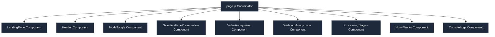

# Components Documentation (`src/components/`)

This directory contains modular React components for the FocusBlur application. Splitting the dashboard interface into cohesive components keeps code readable, isolated, and easy to maintain.

## Architecture & Data Flow

All global states reside in the main coordinator component [page.js](file:///c:/Users/raven/Desktop/React%20Project/face_blur/src/app/page.js), which synchronizes state values and feeds them down as React props.

---

## Component Index

### 0. [LandingPage.js](file:///c:/Users/raven/Desktop/React%20Project/face_blur/src/components/LandingPage.js)
Premium landing page explaining the application's capabilities (Real-time webcam blurring, Selective face preservation, local WASM security, and compliance).
- **Props**:
  - `onTryNow`: Callback function to transition state and launch the workspace.

### 1. [Header.js](file:///c:/Users/raven/Desktop/React%20Project/face_blur/src/components/Header.js)
Static UI component rendering the brand logo, application titles, and metadata tags. Supports navigating back to the landing page.
- **Props**:
  - `onBackToHome`: Optional callback triggered when clicking the logo to go back.

### 2. [ModeToggle.js](file:///c:/Users/raven/Desktop/React%20Project/face_blur/src/components/ModeToggle.js)
A tab-switching component controlling active views.
- **Props**:
  - `activeMode`: `"upload"` or `"camera"`
  - `onModeChange`: Callback changing the parent mode state.

### 3. [SelectiveFacePreservation.js](file:///c:/Users/raven/Desktop/React%20Project/face_blur/src/components/SelectiveFacePreservation.js)
Manages uploads of selfie images and target videos to calculate averaged target face descriptors using face-api.js client-side.
- **Props**:
  - `excludeTarget`: `boolean` setting
  - `setExcludeTarget`: state setter callback
  - `targetDescriptor`: averaged face profile array
  - `setTargetDescriptor`: descriptor state setter callback
  - `setError`: bubbles up registration failures

### 4. [VideoAnonymizer.js](file:///c:/Users/raven/Desktop/React%20Project/face_blur/src/components/VideoAnonymizer.js)
Manages file drag-and-drop zones, source playback players, offscreen canvases, MediaPipe face detections, face-api recognitions, and MediaRecorder file packaging.
- **Props**:
  - `excludeTargetRef`: Reference pointing to parent `excludeTarget` value (avoiding closures).
  - `targetDescriptorRef`: Reference pointing to parent `targetDescriptor` value.
  - `status`: active execution progress indicator.
  - `setStatus`: progress state setter callback.
  - `loading`: loading boolean.
  - `setLoading`: loading state setter callback.
  - `error`: error state.
  - `setError`: error setter.

### 5. [WebcamAnonymizer.js](file:///c:/Users/raven/Desktop/React%20Project/face_blur/src/components/WebcamAnonymizer.js)
Manages raw webcam stream access (with safety metadata promise loaders), dynamic requestAnimationFrame face blurring pipelines, and webcam recording.
- **Props**:
  - `excludeTargetRef`: Reference pointing to parent `excludeTarget` value.
  - `targetDescriptorRef`: Reference pointing to parent `targetDescriptor` value.
  - `loading`: loading boolean.
  - `setLoading`: loading state setter.
  - `error`: error state.
  - `setError`: error setter.

### 6. [ProcessingStages.js](file:///c:/Users/raven/Desktop/React%20Project/face_blur/src/components/ProcessingStages.js)
Renders visual steps/checklists (Initialize, Process, Encode) matching execution status.

### 7. [ConsoleLogs.js](file:///c:/Users/raven/Desktop/React%20Project/face_blur/src/components/ConsoleLogs.js)
Renders custom intercepted logs.

### 8. [HowItWorks.js](file:///c:/Users/raven/Desktop/React%20Project/face_blur/src/components/HowItWorks.js)
Renders static instructions regarding WebAssembly, MediaPipe, and MediaRecorder APIs.
